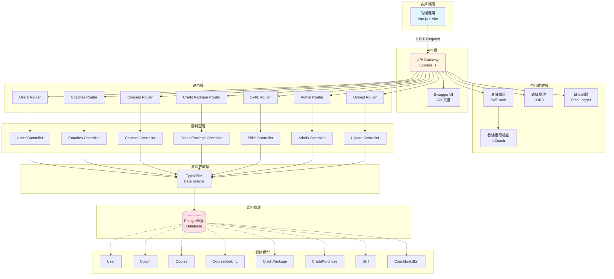
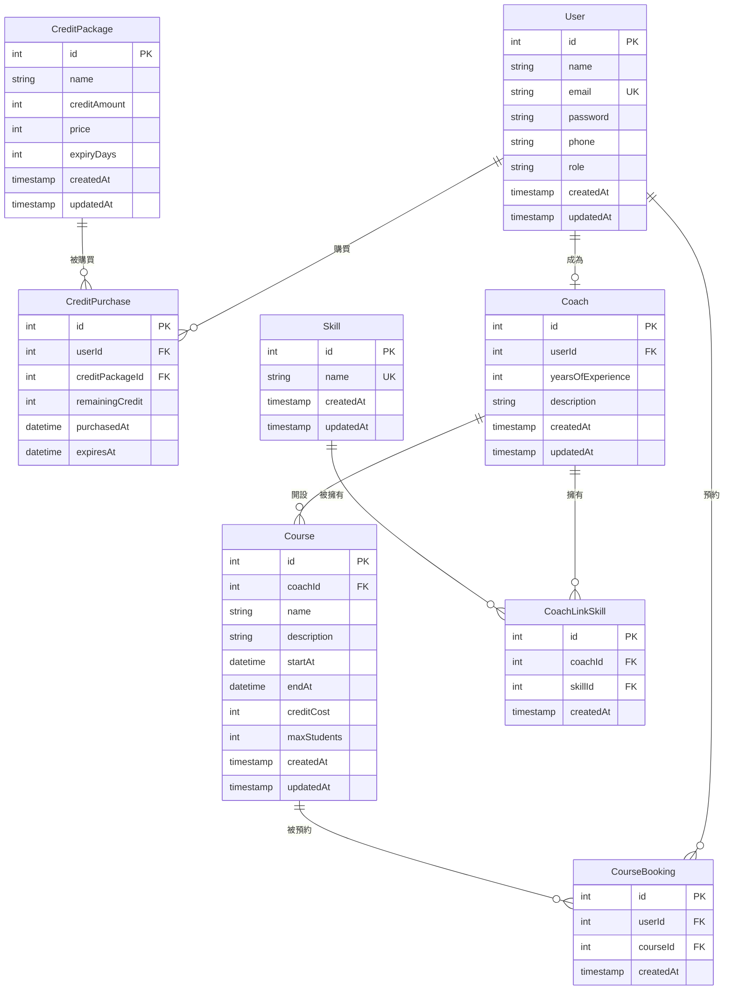
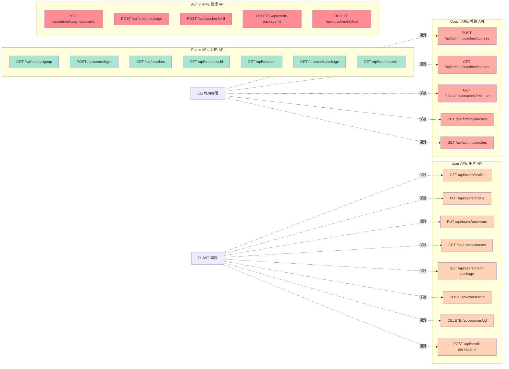
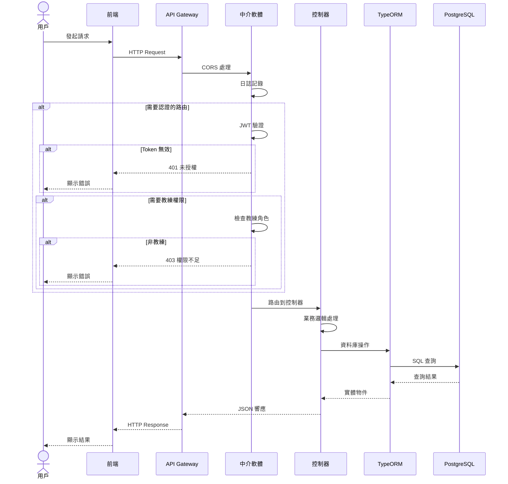
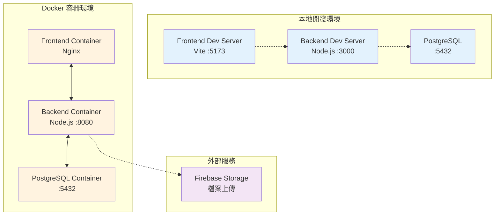
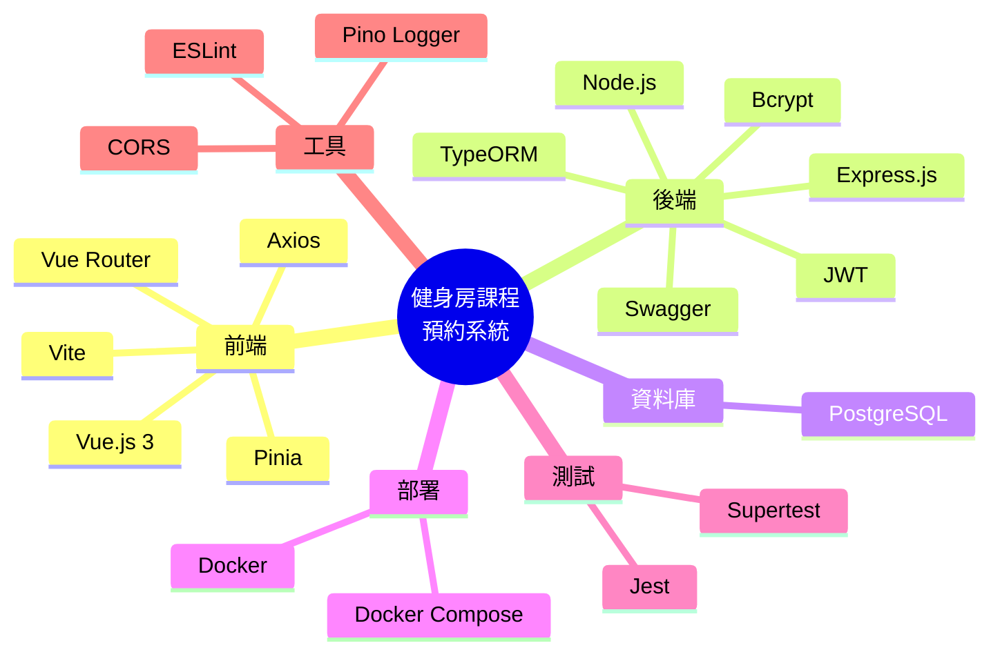
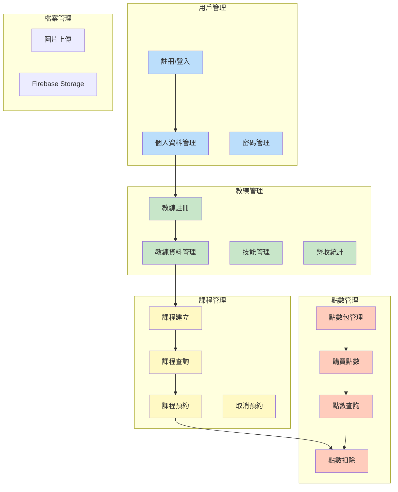

# 健身房課程預約系統 - 系統架構圖

## 整體系統架構

```mermaid
graph TB
    subgraph "客戶端層"
        FE[前端應用<br/>Vue.js + Vite]
    end
    
    subgraph "API 層"
        API[API Gateway<br/>Express.js]
        SWAGGER[Swagger UI<br/>API 文檔]
    end
    
    subgraph "中介軟體層"
        AUTH[身份驗證<br/>JWT Auth]
        COACH[教練權限檢查<br/>isCoach]
        CORS[跨域處理<br/>CORS]
        LOGGER[日誌記錄<br/>Pino Logger]
    end
    
    subgraph "路由層"
        USERS[Users Router]
        COACHES[Coaches Router]
        COURSES[Courses Router]
        CREDIT[Credit Package Router]
        SKILLS[Skills Router]
        ADMIN[Admin Router]
        UPLOAD[Upload Router]
    end
    
    subgraph "控制器層"
        UC[Users Controller]
        COC[Coaches Controller]
        CRC[Courses Controller]
        CPC[Credit Package Controller]
        SC[Skills Controller]
        AC[Admin Controller]
        UPC[Upload Controller]
    end
    
    subgraph "資料存取層"
        ORM[TypeORM<br/>Data Source]
    end
    
    subgraph "資料庫層"
        DB[(PostgreSQL<br/>Database)]
    end
    
    subgraph "實體模型"
        E1[User]
        E2[Coach]
        E3[Course]
        E4[CourseBooking]
        E5[CreditPackage]
        E6[CreditPurchase]
        E7[Skill]
        E8[CoachLinkSkill]
    end
    
    FE -->|HTTP Request| API
    API --> SWAGGER
    API --> CORS
    API --> LOGGER
    API --> AUTH
    AUTH --> COACH
    
    API --> USERS
    API --> COACHES
    API --> COURSES
    API --> CREDIT
    API --> SKILLS
    API --> ADMIN
    API --> UPLOAD
    
    USERS --> UC
    COACHES --> COC
    COURSES --> CRC
    CREDIT --> CPC
    SKILLS --> SC
    ADMIN --> AC
    UPLOAD --> UPC
    
    UC --> ORM
    COC --> ORM
    CRC --> ORM
    CPC --> ORM
    SC --> ORM
    AC --> ORM
    UPC --> ORM
    
    ORM --> DB
    
    DB -.-> E1
    DB -.-> E2
    DB -.-> E3
    DB -.-> E4
    DB -.-> E5
    DB -.-> E6
    DB -.-> E7
    DB -.-> E8
    
    style FE fill:#e1f5ff
    style API fill:#fff4e1
    style DB fill:#ffe1e1
```

## 資料庫 ER 圖

```mermaid
erDiagram
    User ||--o{ CourseBooking : "預約"
    User ||--o{ CreditPurchase : "購買"
    User ||--o| Coach : "成為"
    
    Coach ||--o{ Course : "開設"
    Coach ||--o{ CoachLinkSkill : "擁有"
    
    Course ||--o{ CourseBooking : "被預約"
    
    CreditPackage ||--o{ CreditPurchase : "被購買"
    
    Skill ||--o{ CoachLinkSkill : "被擁有"
    
    User {
        int id PK
        string name
        string email UK
        string password
        string phone
        string role
        timestamp createdAt
        timestamp updatedAt
    }
    
    Coach {
        int id PK
        int userId FK
        int yearsOfExperience
        string description
        timestamp createdAt
        timestamp updatedAt
    }
    
    Course {
        int id PK
        int coachId FK
        string name
        string description
        datetime startAt
        datetime endAt
        int creditCost
        int maxStudents
        timestamp createdAt
        timestamp updatedAt
    }
    
    CourseBooking {
        int id PK
        int userId FK
        int courseId FK
        timestamp createdAt
    }
    
    CreditPackage {
        int id PK
        string name
        int creditAmount
        int price
        int expiryDays
        timestamp createdAt
        timestamp updatedAt
    }
    
    CreditPurchase {
        int id PK
        int userId FK
        int creditPackageId FK
        int remainingCredit
        datetime purchasedAt
        datetime expiresAt
    }
    
    Skill {
        int id PK
        string name UK
        timestamp createdAt
        timestamp updatedAt
    }
    
    CoachLinkSkill {
        int id PK
        int coachId FK
        int skillId FK
        timestamp createdAt
    }
```

## API 路由架構

```mermaid
graph LR
    subgraph "Public APIs 公開 API"
        A1[GET /api/users/signup]
        A2[POST /api/users/login]
        A3[GET /api/coaches]
        A4[GET /api/coaches/:id]
        A5[GET /api/courses]
        A6[GET /api/credit-package]
        A7[GET /api/coaches/skill]
    end
    
    subgraph "User APIs 用戶 API"
        B1[GET /api/users/profile]
        B2[PUT /api/users/profile]
        B3[PUT /api/users/password]
        B4[GET /api/users/courses]
        B5[GET /api/users/credit-package]
        B6[POST /api/courses/:id]
        B7[DELETE /api/courses/:id]
        B8[POST /api/credit-package/:id]
    end
    
    subgraph "Coach APIs 教練 API"
        C1[POST /api/admin/coaches/courses]
        C2[GET /api/admin/coaches/courses]
        C3[GET /api/admin/coaches/revenue]
        C4[PUT /api/admin/coaches]
        C5[GET /api/admin/coaches]
    end
    
    subgraph "Admin APIs 管理 API"
        D1[POST /api/admin/coaches/:userId]
        D2[POST /api/credit-package]
        D3[POST /api/coaches/skill]
        D4[DELETE /api/credit-package/:id]
        D5[DELETE /api/coaches/skill/:id]
    end
    
    AUTH[🔐 JWT 認證] -.->|保護| B1
    AUTH -.->|保護| B2
    AUTH -.->|保護| B3
    AUTH -.->|保護| B4
    AUTH -.->|保護| B5
    AUTH -.->|保護| B6
    AUTH -.->|保護| B7
    AUTH -.->|保護| B8
    
    COACH[👨‍🏫 教練權限] -.->|保護| C1
    COACH -.->|保護| C2
    COACH -.->|保護| C3
    COACH -.->|保護| C4
    COACH -.->|保護| C5
    
    style A1 fill:#a8e6cf
    style A2 fill:#a8e6cf
    style A3 fill:#a8e6cf
    style A4 fill:#a8e6cf
    style A5 fill:#a8e6cf
    style A6 fill:#a8e6cf
    style A7 fill:#a8e6cf
    style B1 fill:#ffd3b6
    style B2 fill:#ffd3b6
    style B3 fill:#ffd3b6
    style B4 fill:#ffd3b6
    style B5 fill:#ffd3b6
    style B6 fill:#ffd3b6
    style B7 fill:#ffd3b6
    style B8 fill:#ffd3b6
    style C1 fill:#ffaaa5
    style C2 fill:#ffaaa5
    style C3 fill:#ffaaa5
    style C4 fill:#ffaaa5
    style C5 fill:#ffaaa5
    style D1 fill:#ff8b94
    style D2 fill:#ff8b94
    style D3 fill:#ff8b94
    style D4 fill:#ff8b94
    style D5 fill:#ff8b94
```

## 請求流程圖

```mermaid
sequenceDiagram
    actor U as 用戶
    participant F as 前端
    participant A as API Gateway
    participant M as 中介軟體
    participant C as 控制器
    participant O as TypeORM
    participant D as PostgreSQL
    
    U->>F: 發起請求
    F->>A: HTTP Request
    A->>M: CORS 處理
    M->>M: 日誌記錄
    
    alt 需要認證的路由
        M->>M: JWT 驗證
        alt Token 無效
            M-->>F: 401 未授權
            F-->>U: 顯示錯誤
        end
        
        alt 需要教練權限
            M->>M: 檢查教練角色
            alt 非教練
                M-->>F: 403 權限不足
                F-->>U: 顯示錯誤
            end
        end
    end
    
    M->>C: 路由到控制器
    C->>C: 業務邏輯處理
    C->>O: 資料庫操作
    O->>D: SQL 查詢
    D-->>O: 查詢結果
    O-->>C: 實體物件
    C-->>A: JSON 響應
    A-->>F: HTTP Response
    F-->>U: 顯示結果
```

## 部署架構

```mermaid
graph TB
    subgraph "本地開發環境"
        DEV1[Frontend Dev Server<br/>Vite :5173]
        DEV2[Backend Dev Server<br/>Node.js :3000]
        DEV3[PostgreSQL<br/>:5432]
    end
    
    subgraph "Docker 容器環境"
        DC1[Frontend Container<br/>Nginx]
        DC2[Backend Container<br/>Node.js :8080]
        DC3[PostgreSQL Container<br/>:5432]
        
        DC1 <--> DC2
        DC2 <--> DC3
    end
    
    subgraph "外部服務"
        EXT1[Firebase Storage<br/>檔案上傳]
    end
    
    DEV1 -.-> DEV2
    DEV2 -.-> DEV3
    DC2 -.-> EXT1
    
    style DEV1 fill:#e3f2fd
    style DEV2 fill:#e3f2fd
    style DEV3 fill:#e3f2fd
    style DC1 fill:#fff3e0
    style DC2 fill:#fff3e0
    style DC3 fill:#fff3e0
    style EXT1 fill:#f3e5f5
```

## 技術棧

```mermaid
mindmap
  root((健身房課程<br/>預約系統))
    前端
      Vue.js 3
      Vite
      Vue Router
      Pinia
      Axios
    後端
      Node.js
      Express.js
      TypeORM
      JWT
      Bcrypt
      Swagger
    資料庫
      PostgreSQL
    部署
      Docker
      Docker Compose
    測試
      Jest
      Supertest
    工具
      ESLint
      Pino Logger
      CORS
```

## 核心功能模組

```mermaid
graph TB
    subgraph "用戶管理"
        UM1[註冊/登入]
        UM2[個人資料管理]
        UM3[密碼管理]
    end
    
    subgraph "教練管理"
        CM1[教練註冊]
        CM2[教練資料管理]
        CM3[技能管理]
        CM4[營收統計]
    end
    
    subgraph "課程管理"
        CRM1[課程建立]
        CRM2[課程查詢]
        CRM3[課程預約]
        CRM4[取消預約]
    end
    
    subgraph "點數管理"
        CPM1[點數包管理]
        CPM2[購買點數]
        CPM3[點數查詢]
        CPM4[點數扣除]
    end
    
    subgraph "檔案管理"
        FM1[圖片上傳]
        FM2[Firebase Storage]
    end
    
    UM1 --> UM2
    UM2 --> CM1
    CM1 --> CM2
    CM2 --> CRM1
    CRM1 --> CRM2
    CRM2 --> CRM3
    CRM3 --> CPM4
    CPM1 --> CPM2
    CPM2 --> CPM3
    CPM3 --> CPM4
    
    style UM1 fill:#bbdefb
    style UM2 fill:#bbdefb
    style UM3 fill:#bbdefb
    style CM1 fill:#c8e6c9
    style CM2 fill:#c8e6c9
    style CM3 fill:#c8e6c9
    style CM4 fill:#c8e6c9
    style CRM1 fill:#fff9c4
    style CRM2 fill:#fff9c4
    style CRM3 fill:#fff9c4
    style CRM4 fill:#fff9c4
    style CPM1 fill:#ffccbc
    style CPM2 fill:#ffccbc
    style CPM3 fill:#ffccbc
    style CPM4 fill:#ffccbc
```
